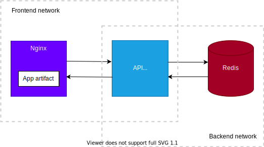

# CryptoPrices

Is a Web Application that displays the historical data of Bitcoin prices. Things that are relevant for this project:

- **Scalability**: consider scenarios where this project could be subject to high traffic and needs to be easily deployed on several servers
- **Timezone**: it should take into consideration the local time of the user

## Assumptions

**Costs**
- It's more costly (in both money and performance) to hit the CoinApi instead of hosting a Redis store
- Even when serializing/deserializing price data to/from `JSON` is still more cost-effective than making a request to the CoinApi.

**Date**
- USD currency will be used
- Dates in the frontend should be displayed in local time so that it's familiar to the user
- Dates should be sent to the server in UTC to simplify calculations
- In the UI, when the selected date-time is past the current time it will assume the user wanted the most recent data.

**Cached Data**
- Since the cache is at the server level, users that first come to the application will benefit from already cached data form other users.

## Architecture

<div style="background-color:white; padding: 1rem;margin: 1rem;">
    
</div>

> NOTE: All components were dockerized in independant containers.

### Frontend

**App**

`React` library was chosen to speed up development, no CSS framework needed. All assets are compiled for production
and deployed to an `Nginx` server.

**Nginx**

It was picked for two reasons: familiarity with it and capacity to handle tons of requests without blocking. It's used to handle all static assets but also as a reverse proxy so that all requests made from the frontend application are redirected to the API server. This also avoids the need for configuring CORS.

### Backend

**API**

It was built using `FastAPI`, a python web framework. Reasons to use it:
    - Supports async operations: a good fit for just fetching data from other sources
    - Lightweight
    - Docs from code
    - I've wanted to use it for some time now

To deploy `FastAPI`, `uvicorn` was used as `asgi` container and `gunicorn` to handle multiple processes.

**Redis**

It seemed a good fit for the project since it allowed to cache the results coming from `CoinApi` using [sorted maps](https://redis.io/commands/zrangebyscore) to query date ranges with a small cost.

## Setup

1. Open a terminal and go to the repository folder:

    ```
    cd cryptoprices 
    ```

2. Build the docker image

    ```
    docker-compose build
    ```

3. Run the docker container

    ```
    API_KEY=YOUR_API_KEY docker-compose up -d
    ```

    where `YOUR_API_KEY` should be obtained from [coinapi.io](https://coinapi.io)

4. You should be able to access the app on [http://localhost](http://localhost).

## Troubleshooting

### Port forwarding

If you have issues with the ports being forwarded to the host machine, please refer to `docker-compose.yml` for more details. By default ports `80` and `5000` will be used for the app and the API respectively.

### Accessing Redis

To access the redis container, use the followiing command from the root directory of the repository:

```
docker-compose exec redis redis-cli YOUR_REDIS_COMMAND
````

**Get all `bitcoin` cached resulst**

```
docker-compose exec redis redis-cli zcount BTC 0 100000000000000
````

**Remove all data**

```
docker-compose exec redis redis-cli FLUSHALL
````